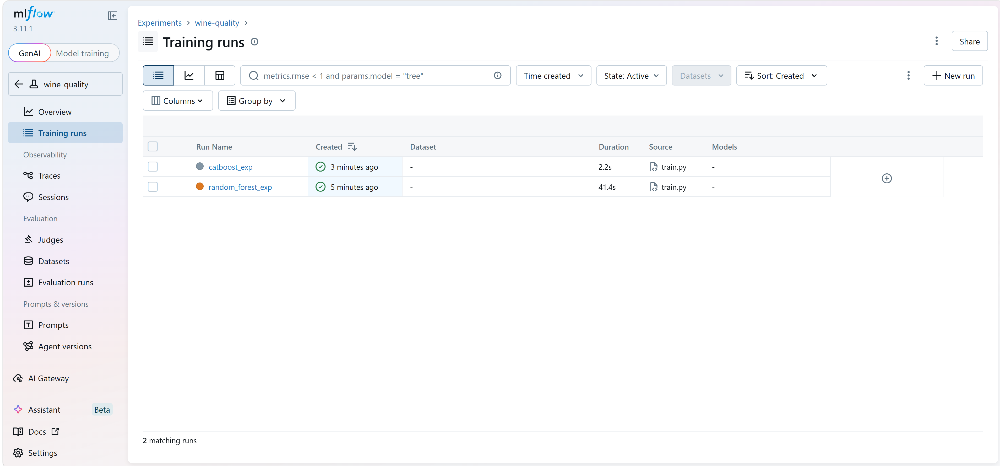
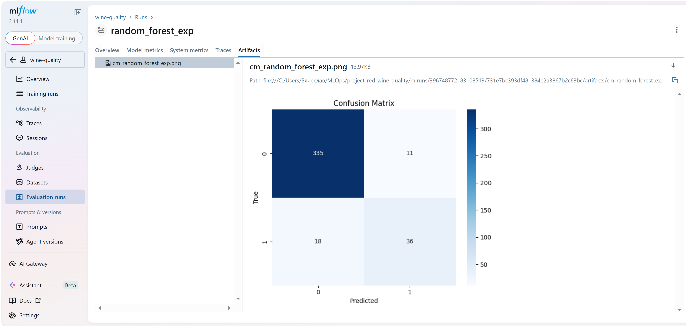
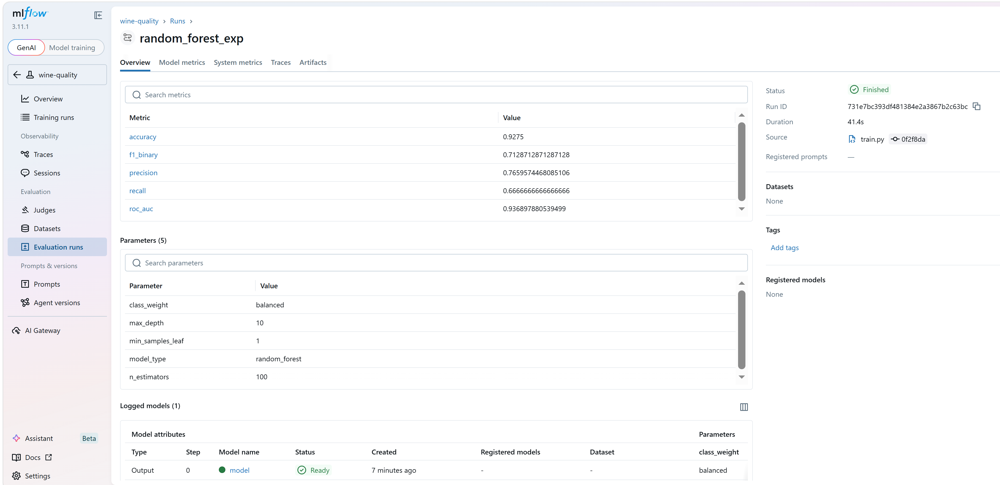
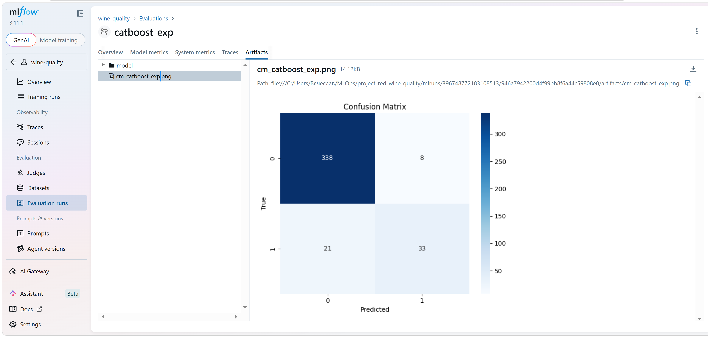
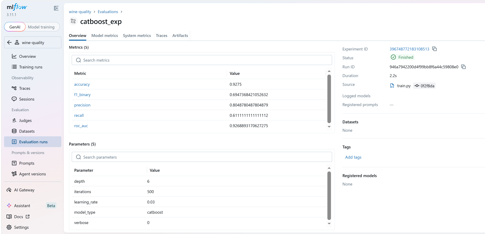

# Red Wine Quality Prediction

ML-проект по классификации качества вина (binary: good/bad) с полным MLOps-циклом:
- Эксперименты и трекинг (MLflow)
- Версионирование данных и моделей (DVC + MinIO)
- Автоматизация обучения (Apache Airflow)
- API для предсказаний (FastAPI)

---

## Результаты экспериментов

### Dashboard


### Confusion Matrix (Random Forest)


### Parameters (Random Forest)


### Confusion Matrix (CatBoost)


### Parameters (CatBoost)


## Метрики

| Модель | Accuracy | F1-Score (binary) | ROC-AUC |
|--------|----------|-------------------|---------|
| Random Forest | 0.9275 | 0.7129 | **0.9369** |
| CatBoost | 0.9275 | 0.6947 | 0.9269 |

> **Выбранная модель:** Random Forest показала наилучший ROC-AUC и более стабильный F1-score на несбалансированных данных. Эта версия модели сохранена через DVC (`models/rf_model.pkl.dvc`).

## Быстрый старт (локально)

### 1. Клонировать репозиторий и установить зависимости
```bash
git clone <your-repo>
cd project_red_wine_quality
pip install -r requirements.txt
```

### 2. Подтянуть данные через DVC
```bash
dvc pull data/winequality-red.csv
```
### 3. Запустить обучение
```bash
# Random Forest
python src/train.py --model random_forest

# CatBoost
python src/train.py --model catboost
```
### 4. Просмотреть эксперименты в MLflow
```bash
mlflow ui --port 5000
# Открыть: http://127.0.0.1:5000
```
## Автоматизация обучения (Airflow)

### Архитектура
| Компонент | Инструмент | Почему |
|-----------|-----------|--------|
| **Оркестрация** | Apache Airflow (LocalExecutor) | Простота для локальной разработки, не требует Redis/Celery |
| **Трекинг экспериментов** | MLflow (файловый бэкенд) | Логирование метрик и параметров без сетевого сервера |
| **Версионирование модели** | DVC | Большие артефакты хранятся в удалённом хранилище, дедупликация |

### Почему модель не логируется в MLflow (`log_model` закомментирован)?
1. **Docker-совместимость**: Файловый бэкенд MLflow внутри Linux-контейнера некорректно обрабатывает Windows-пути из конфига, что приводит к `PermissionError: '/C:'`.
2. **Лучшая практика**: Большие бинарные артефакты (модели) хранятся в DVC/S3, а метаданные (метрики, параметры) — в MLflow. Это упрощает управление версиями и хранение.

### Запуск
### 1. Создать volume (один раз)
Windows
```bash
docker volume create --driver local --opt type=none --opt device=<path to directory> --opt o=bind wine-project
```
Linux/Mac:
```bash
docker volume create --driver local --opt type=none --opt device=$(pwd) --opt o=bind wine-project
```
### 2. Запустить Airflow
```bash
cd airflow
docker compose up -d
```
### 3. Открыть UI: http://127.0.0.1:8080 (admin/admin)

### 4. Запустить DAG вручную или дождаться ежедневного запуска (@daily)
```bash
docker compose exec airflow-webserver airflow dags trigger wine_quality_training
```
### Визуальные артефакты в автоматизации


Confusion matrix генерируется локально в функции `save_confusion_matrix()`, но не логируется в MLflow внутри DAG Airflow. Причина:
- Файловый бэкенд MLflow в Docker-среде может некорректно обрабатывать относительные пути для `log_artifact()`
- Для продакшен-пайплайнов визуальные артефакты часто генерируются отдельно (локально или в post-processing шаге)

Для локального анализа: запустите `python src/train.py --model random_forest` — confusion matrix сохранится в корне проекта как `cm_*.png`.

## API сервис (FastAPI)

### Эндпоинты
| Метод | Путь | Описание |
|-----------|-----------|--------|
| **GET** | / | Приветствие и список эндпоинтов |
| **POST** | /predict | Предсказание качества вина (11 признаков) |
| **GET** | /health | Проверка работоспособности сервиса |
| **GET** | /model-info | Метаданные моели

### Запуск
### 1. Подтянуть модель из DVC (если нет локально)
```bash
dvc pull models/rf_model.pkl
```
### 2. Запустить сервер
```bash
uvicorn api.main:app --host 127.0.0.1 --port 8000
```
### 3. Открыть документацию: http://127.0.0.1:8000/docs

### Источники данных:
Метрики и параметры - models/model_metadata.json, который создается в train.py

Версия модели - хэш из DVC-метафайла (models/rf_model.pkl.dvc)

Дата обучения - pd.Timestamp.now() при сохранении

После каждого запуска DAG в Airflow метаданные обновляются автоматически

### Интеграция с DVC
Модель загружается автоматически при старте (ModelLoader). Если файла нет — выполняется dvc pull.
Версия модели (хэш) возвращается в ответе /predict и /model-info.
Ключи для удалённого хранилища передаются через переменные окружения (AWS_*)

## CI/CD Pipeline
### Этапы pipeline
| Stage                 | Задача                   | Инструмент                     |
|-----------------------|--------------------------|--------------------------------|
| **Lint**              | Проверка кода            | flake8                         |
| **DVC Check**         | Проверка версионирования | dvc status, dvc pull --dry-run |
| **Unit Tests**        | Тесты API                | pytest                         |
| **Integration Tests** | Полные сценарии          | pytest (manual)                |

### Настройка переменных окружения
В GitLab CI/CD Variables необходимо добавить:
- AWS_ACCESS_KEY_ID=<ключ>
- AWS_SECRET_ACCESS_KEY=<секретный ключ>
- AWS_ENDPOINT_URL=https://s3.lab.karpov.courses
- AWS_DEFAULT_REGION=us-east-1

Ключи должны быть **Masked**

### Запуск pipeline
Pipeline запускается автоматически при push в ветку main и создании Merge Request